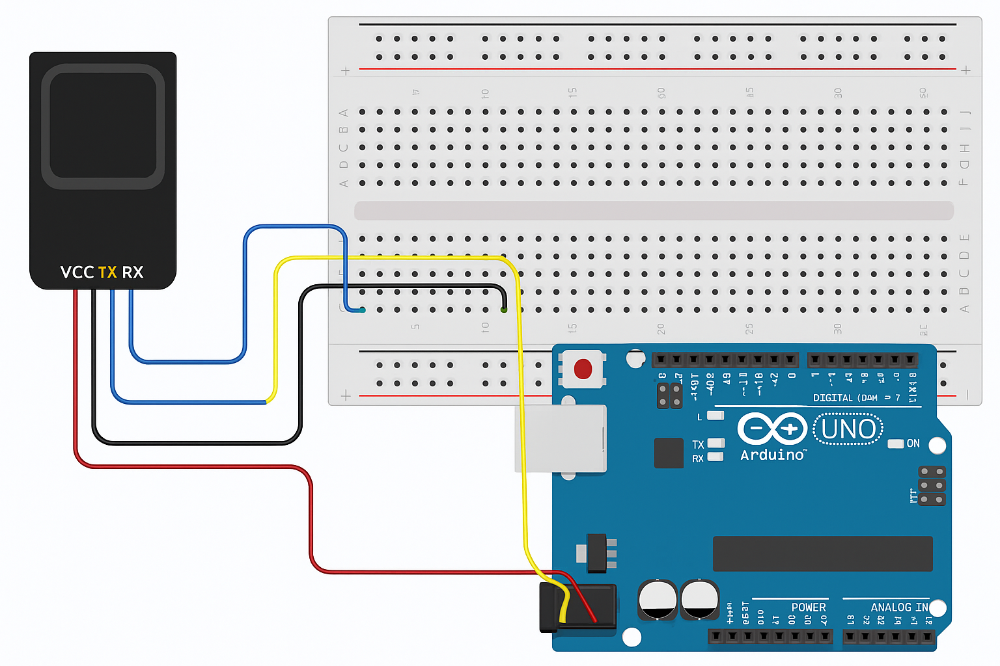

# Projet de reconnaissance d'Empreintes Digitales avec Arduino

ce projet utilise un capteur d'empreinte digitale pour iodentifier les utilisateurs enregistrés. il est réalisé avec une carte Arduino UNO et un capteur compatible Adafruit (modèel R305 ou équivalent).

## Matériels utilisés

- Arduino UNO 
- Capteur d'empreinte digitale (type R305)
- câble à double connecteur JST blanc
- carte d'essaie
- Servo moteur
- Jumper
- Afficheur
- Trimpot ou Potentiomètre ajustable

## Bibliothèques nécessaires

- `Adafruit_Fingerprint`
- `SoftwareSerial`

Installez-les via le gestionnaire de bibliothèques de l'IDE Arduino.

## schéma de câblage

Le schéma ci-dessous montre comment connecter le lecteur d'empreinte digitale à la carte Arduino :

- VCC du capteur → 5V de l'Arduino
- GND du capteur → GND de l'Arduino
- TX du capteur → Pin 2 (RX logiciel)
- RX du capteur → Pin 3 (TX logiciel)

## Fonctionnement

- Le capteur lit une empreinte.
- Si elle est enregisytrée, l'ID correspondant s'affiche dans le moniteur série.
- Sinon, rien ne se passe.

## Instructions

1. connectez les câbles comme indiqué ci-dessus.
2. Téléversez le code `fingerprint_recognition.ino` sur votre Arduino.
3. Ouvrez le moniteur série à 9600 bauds.
4. Placez un doigt sur le capteur.

## Auteur

Projet réalisé par BELIANA MALANDALA dans le cadre d'un travail de fin d'année.