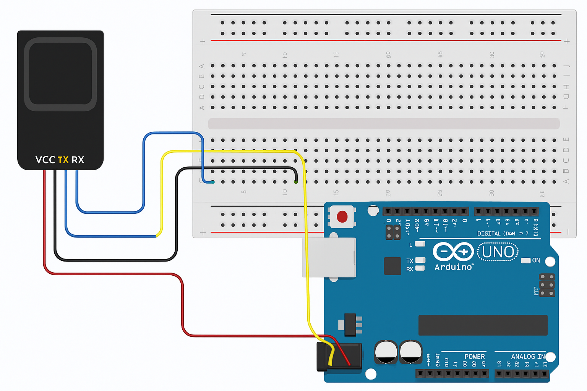

# Projet de reconnaissance d'Empreintes Digitales avec Arduino

ce projet utilise un capteur d'empreinte digitale pour iodentifier les utilisateurs enregistrés. il est réalisé avec une carte Arduino UNO et un capteur compatible Adafruit (modèel R305 ou équivalent).

## Matériels utilisés

- Arduino UNO 
- Capteur d'empreinte digitale (type R305)
- câble à double connecteur JST blanc
- carte d'essaie
- Servo moteur
- Jumper
- Afficheur
- Trimpot ou Potentiomètre ajustable
- Un peigne

## Bibliothèques nécessaires

- `Adafruit_Fingerprint`
- `SoftwareSerial`

Installez-les via le gestionnaire de bibliothèques de l'IDE Arduino.

## schéma de câblage

Le schéma ci-dessous montre comment connecter le lecteur d'empreinte digitale à la carte Arduino :

- VCC du capteur → 5V de l'Arduino
- GND du capteur → GND de l'Arduino
- TX du capteur → Pin 2 (RX logiciel)
- RX du capteur → Pin 3 (TX logiciel)

## Fonctionnement

Le capteur d'empreintes lit l'empreinte deposée. Si celle-ci est reconnue par le système, la personne est autorisée à entrer dans la pièce. Mais dans le cas contraire, l'accès lui est refusé.

## Instructions

1. Approchez-vous du dispositif et placez votre doigt sur le capteur d'empreintes.
2. Le capteur lit l'empreinte et vérifie si elle correspond à une empreinte enregistrée.
3. si l'empreinte est reconnue :
   - L'accès est accordée.
   - Une LED ou un autre mécanisme (porte, alarme, etc.) peut indiquer l'autorisation.
4. Si l'empreinte est inconnue :
   - L'accès est refusé.
   - Aucun signal d'ouverture n'est déclenché.

## Auteur

Projet réalisé par BELIANA MALANDALA dans le cadre d'un travail de fin d'année.
